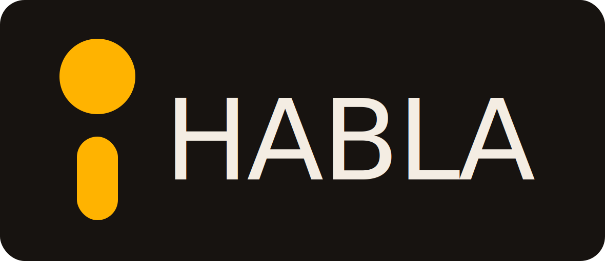

<p align="center">
  
</p>

<h1 align="center">HABLA</h1>

<p align="center"><strong>No lo tipees. Dilo.</strong></p>

<p align="center">
Dictado por voz libre, gratis y 100% offline, hecho para Latinoamérica.<br>
Apretás una tecla, hablás, y el texto aparece donde tengas el cursor: Cursor, Claude Code, la terminal, donde sea.
</p>

---

## Por qué existe HABLA

Si programás con IA, ya no escribís código: escribís **párrafos**. Prompts largos, contexto, instrucciones. Hablar es 3–4 veces más rápido que tipear — pero las herramientas buenas de dictado son pagas en dólares, piensan en inglés y mandan tu voz a un servidor ajeno.

HABLA es la respuesta de este lado del mapa:

- **Gratis.** No "gratis por 14 días". Gratis.
- **Libre.** Código abierto (MIT). Es tuyo: revisalo, mejoralo, forkealo.
- **Privado.** Tu voz no sale de tu compu. La transcripción corre 100% local, sin nube.
- **En tu idioma.** Entiende tu español — el de verdad, con tu acento — y otros 90+ idiomas.
- **Simple.** Una tecla, una función: transcribir lo que decís y ponerlo donde estés escribiendo.

## Cómo funciona

1. **Apretá** el atajo de teclado (configurable, o modo pulsar-para-hablar).
2. **Hablá.** Decí tu prompt como se lo dirías a un compañero.
3. **Soltá.** HABLA procesa tu voz en tu propia máquina con Whisper o Parakeet.
4. **Listo.** El texto aparece pegado en la app que estés usando.

Todo el proceso es local:

- El silencio se filtra con VAD (Silero).
- Transcripción a elección:
  - **Modelos Whisper** (Small/Medium/Turbo/Large), con aceleración por GPU si hay.
  - **Parakeet V3**, optimizado para CPU, con detección automática de idioma.
- Funciona en **Windows, macOS y Linux**.

## Descarga

➡️ **[Descargá la última versión](https://github.com/habla-voz/habla/releases/latest)** — instaladores para Windows (x64), macOS (Intel y Apple Silicon) y Linux (x64).

1. Instalá la aplicación.
2. Abrila y otorgá los permisos del sistema (micrófono; accesibilidad en macOS).
3. Elegí tu atajo de teclado en Ajustes.
4. Hablá.

> **Recomendación para hardware modesto:** el modelo **Parakeet V3** corre bien en CPU (desde Intel de 6ª generación) a ~5x tiempo real. Los modelos Whisper rinden mejor con GPU.

## CLI

HABLA se puede controlar desde la terminal (los flags van a la instancia ya abierta):

```bash
habla --toggle-transcription    # Grabar / frenar
habla --toggle-post-process     # Grabar con post-procesado
habla --cancel                  # Cancelar la operación en curso
habla --start-hidden            # Arrancar sin mostrar la ventana
habla --no-tray                 # Arrancar sin ícono de bandeja
habla --debug                   # Modo debug con logs verbosos
```

En Linux/Wayland podés atar esos comandos a atajos de tu compositor (GNOME, KDE, Sway, Hyprland) o usar señales Unix: `SIGUSR2` alterna la transcripción y `SIGUSR1` la transcripción con post-procesado (`pkill -USR2 -n habla`).

## Instalación manual de modelos

Si tu red bloquea la descarga automática, bajá los modelos a mano y ponelos en la carpeta `models` del directorio de datos (lo ves en **Ajustes → Acerca de**; típico en Windows: `%APPDATA%\com.habla.app\models`).

**Whisper (archivos `.bin`, van directo en `models/`):**

| Modelo | Tamaño | URL |
|---|---|---|
| Small | 487 MB | `https://blob.handy.computer/ggml-small.bin` |
| Medium | 492 MB | `https://blob.handy.computer/whisper-medium-q4_1.bin` |
| Turbo | 1600 MB | `https://blob.handy.computer/ggml-large-v3-turbo.bin` |
| Large | 1100 MB | `https://blob.handy.computer/ggml-large-v3-q5_0.bin` |

**Parakeet (archivos `.tar.gz`, se descomprimen y la carpeta va en `models/` con su nombre exacto):**

| Modelo | Carpeta requerida | URL |
|---|---|---|
| V2 | `parakeet-tdt-0.6b-v2-int8` | `https://blob.handy.computer/parakeet-v2-int8.tar.gz` |
| V3 | `parakeet-tdt-0.6b-v3-int8` | `https://blob.handy.computer/parakeet-v3-int8.tar.gz` |

También se auto-descubren modelos Whisper GGML personalizados (`.bin` de Hugging Face) puestos en esa misma carpeta. Reiniciá HABLA después de copiarlos.

## Notas por plataforma

- **Windows:** si Whisper crashea en tu configuración, probá Parakeet V3 (solo CPU, muy estable).
- **macOS:** hay que otorgar permisos de accesibilidad y micrófono la primera vez.
- **Linux:** para que el pegado funcione instalá la herramienta de tu display server: `xdotool` (X11), `wtype` (Wayland) o `dotool`. El overlay de grabación viene desactivado por defecto. Si la app no arranca, revisá que esté instalado `gtk-layer-shell` (`libgtk-layer-shell0` en Debian/Ubuntu) o probá `HABLA con WEBKIT_DISABLE_DMABUF_RENDERER=1`.

¿Problemas? Abrí un [issue](https://github.com/habla-voz/habla/issues) — en español o inglés, como te salga.

## Desarrollo

```bash
git clone https://github.com/habla-voz/habla
cd habla
bun install
bun tauri dev
```

Frontend en React + TypeScript + Tailwind; backend en Rust (Tauri 2). Instrucciones completas por plataforma en [BUILD.md](BUILD.md). Guía de despliegue y releases en [DEPLOY.md](DEPLOY.md).

La identidad de marca (estrategia, voz, sistema visual) vive en [marca/](marca/).

## Origen y créditos

HABLA es un **fork de [Handy](https://github.com/cjpais/handy)**, creado por **CJ Pais** y su comunidad bajo licencia MIT. Sin ese trabajo, esta app no existiría — si HABLA te sirve, considerá [apoyar al proyecto original](https://handy.computer/donate). HABLA no está afiliado a Handy ni cuenta con su respaldo; el rebranding es un requisito de su licencia y esta marca corre por cuenta nuestra.

Gracias también a:

- **Whisper** (OpenAI) y **Parakeet** (NVIDIA) por los modelos de reconocimiento de voz.
- **ggml / transcribe.cpp** (Georgi Gerganov y colaboradores) por la inferencia local.
- **Silero** por el VAD.
- **Tauri** por el framework.

## Licencia

Código bajo [licencia MIT](LICENSE). El nombre HABLA, el isotipo «¡» y los íconos son marca propia y no forman parte de la licencia: los forks deben usar su propia identidad, igual que hicimos nosotros.
